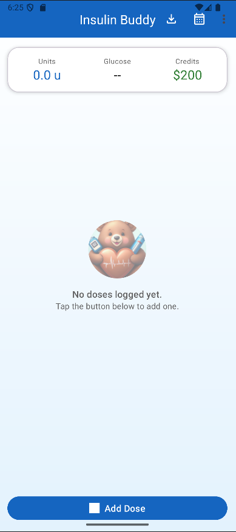
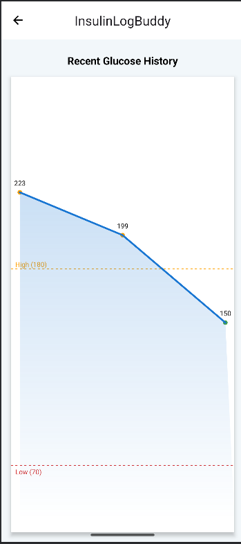
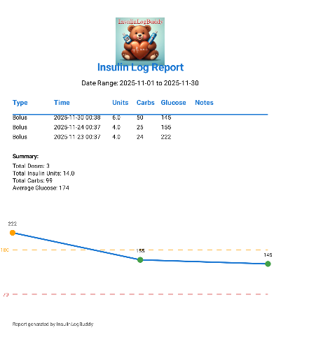
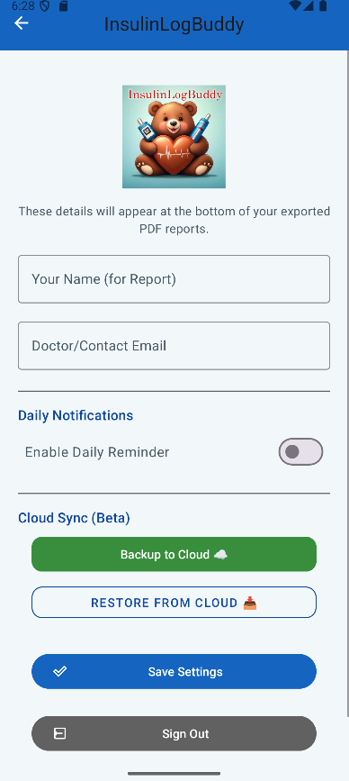
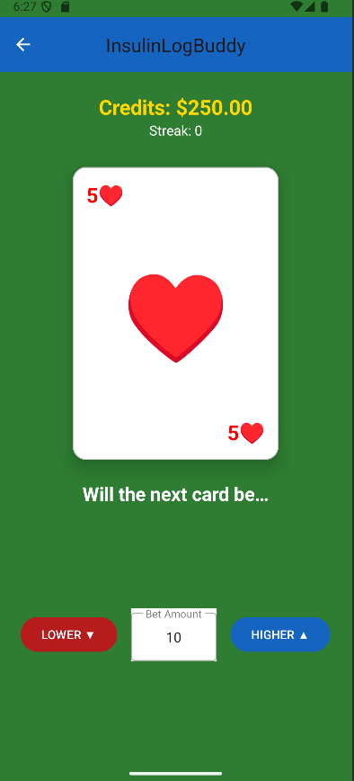
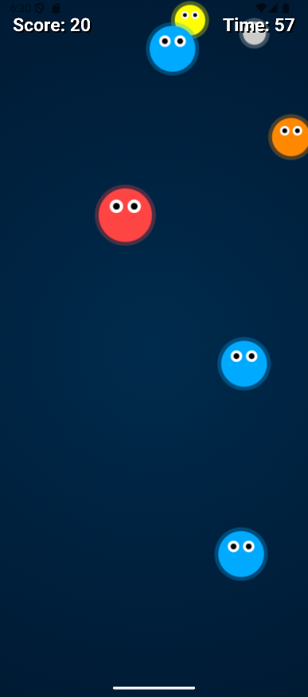
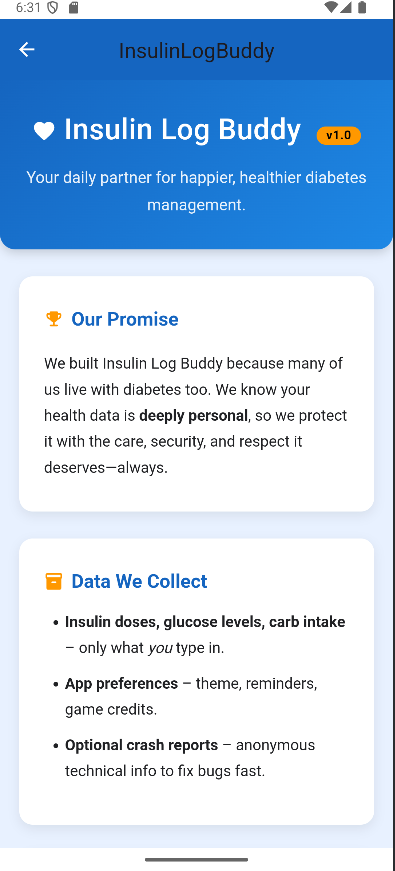

# 🌐 Insulin Log Buddy (Official Website)

> **Note:** This repository hosts the public website and privacy policy. The Android application source code is currently stored in a private repository to protect intellectual property.

# ❤️ InsulinLogBuddy

**A privacy-focused, friendly companion for diabetes management.**

> *"Built with love for my son, and for everyone living with Diabetes and Autism."*

InsulinLogBuddy is a native Android application designed to make tracking Diabetes simple, secure, and even a little bit fun. It combines essential medical logging with gamification elements to encourage consistent tracking.

---

## 📱 App Overview

| **Dashboard** | **Calendar History** | **Glucose Trends** |
|:---:|:---:|:---:|
|  |  |  |
| *Quick access to logging and resources* | *Detailed daily logs at a glance* | *Visualizing highs and lows over time* |

### 🌟 Key Features

* **Smart Logging:** Quickly log Bolus/Long-acting insulin, carbohydrates, glucose levels, and notes. The app remembers your history to suggest units.
* **Visual Data:** Interactive graphs show glucose trends with automatic color-coding for High (>180) and Low (<70) ranges.
* **Doctor-Ready Reports:** Generate professional PDF reports with summary statistics (Total Insulin, Avg Glucose) and charts. Share directly to email or Drive.
* **Calendar View:** Review past days easily. Green indicators show days with activity.
* **Gamification:** Earn "Credits" by logging consistent data. Spend credits on fun mini-games (Dice, High/Low, Snake) to pass the time.
* **Privacy First:** Data is stored locally on the device using Android Room. Cloud backup (Firebase) is optional and user-controlled.

---

## 📸 Feature Gallery

### 📄 Reporting & Sharing
Export your data instantly for doctor visits. The PDF generator creates a clean, easy-to-read summary of any date range.

| **PDF Report** | **Share Sheet** | **Settings & Cloud Sync** |
|:---:|:---:|:---:|
|  |  |  |

### 🎮 Mini-Games (Gamification)
Diabetes management can be stressful. InsulinLogBuddy includes built-in games to decompress, powered by a "Credits" economy earned through good logging habits.

| **Double Dice** | **High / Low Cards** | **Snake** |
|:---:|:---:|:---:|
|  |  |  |

---

## 🛠️ Tech Stack

* **Language:** Java
* **Architecture:** MVC Pattern
* **Local Database:** Android Room (SQLite)
* **Cloud Backend:** Firebase Firestore (for optional backup/restore)
* **UI Components:** Material Design 3, CardViews, Custom Drawables
* **Asynchronous Processing:** `ExecutorService` for background database operations
* **Graphics:** Custom Views for Graphs and PDF Generation

---

## 🔒 Privacy & Security

We take data seriously. Unlike many health apps, **InsulinLogBuddy does not sell data.**

* **Local Storage:** All logs live on your phone by default.
* **No Trackers:** No third-party ad networks or data brokers.
* **Encrypted Sync:** Cloud backups are processed via secure Firebase authentication.

---

## 👨‍💻 Author

**Phillip Mattern**
*Student | Developer | Father*

* **Course:** CIS165DA - Mobile App Development
* **Project Status:** Version 1.0 (Active Development)

---

*© 2025 Insulin Log Buddy. Made with ☕ and care.*
